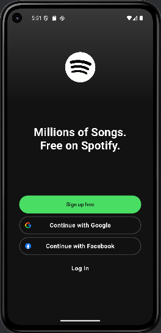

# 🎵 Spotify Clone - Jetpack Compose + Firebase

Este es un clon básico de Spotify creado con **Kotlin** y **Jetpack Compose**, con funcionalidades de autenticación, 
navegación moderna y gestión de usuarios utilizando **Firebase**.

> Proyecto creado con fines de práctica para mejorar habilidades en Android moderno y diseño UI.

---

## 🚀 Tecnologías utilizadas

- 🟣 Kotlin
- 🧩 Jetpack Compose
- 🧭 Navigation Compose
- 🔥 Firebase Authentication
- 🗃️ Firebase Firestore
- 🎨 Material Design 3
- 🔄 ViewModel + StateFlow
- 🛠️ Android Studio

---

## 🖼️ Capturas de Pantalla

  

---

## 🧠 Funcionalidades actuales

- Inicio de sesión y registro de usuario con Firebase
- Interfaz estilo Spotify usando Jetpack Compose
- Estructura modular con navegación dinámica
- Soporte a temas oscuros/claro
- Arquitectura basada en **ViewModel + Firebase Realtime + StateFlow**

---
